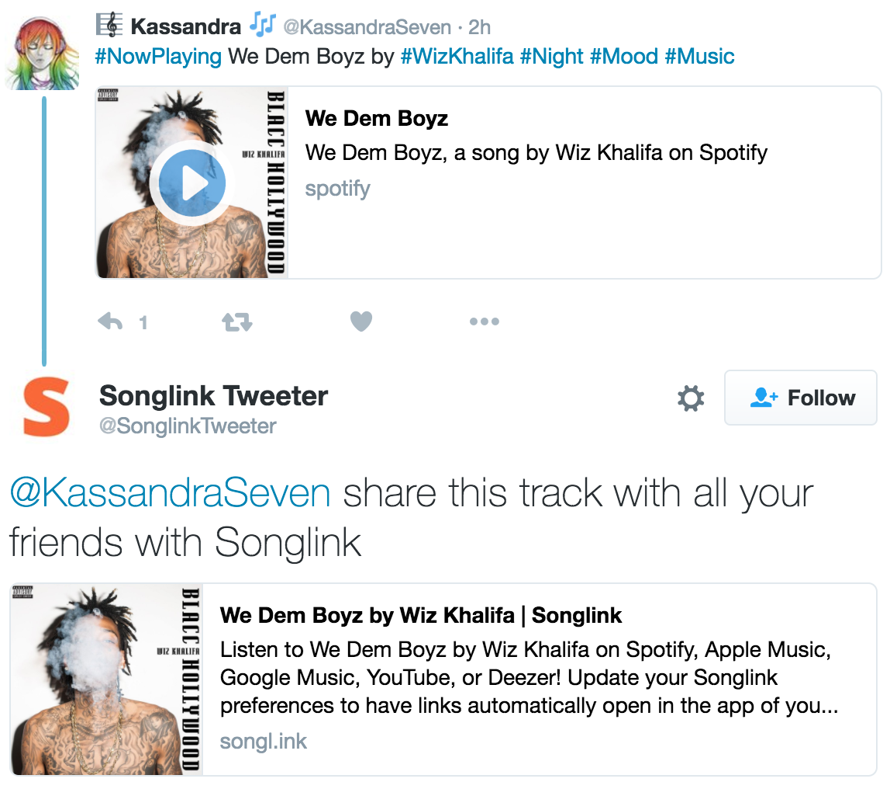

# Songlink Tweeter

> The twitter bot that gives everyone access to your songs.

The [Songlink](http://songl.ink) service makes shareable links from Spotify and other music service links. It allows people that subscribe to a different music service to listen to the song you've shared. __Songlink Tweeter__ searches Twitter for Spotify links and Tweets back a Songlink so subscribers to other services can listen as well.

## How to Get Started ##
Songlink Tweeter is constantly watching Twitter for new Spotify links. A few times an hour, it will pick a top tweet and reply to it with a Songlink.

[__Find Songlink Tweeter on Twitter__](https://twitter.com/SonglinkTweeter)
